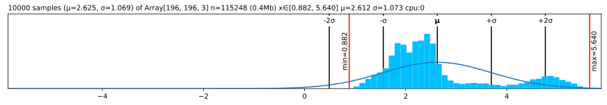
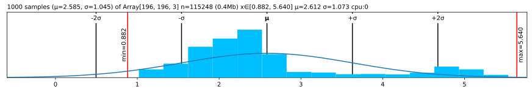
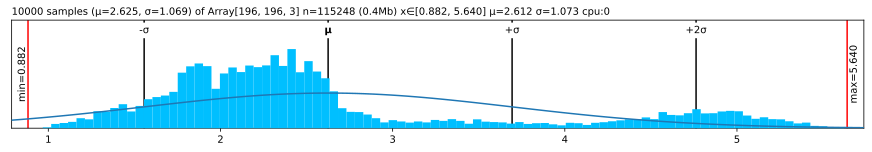
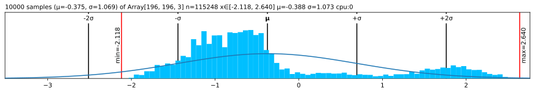
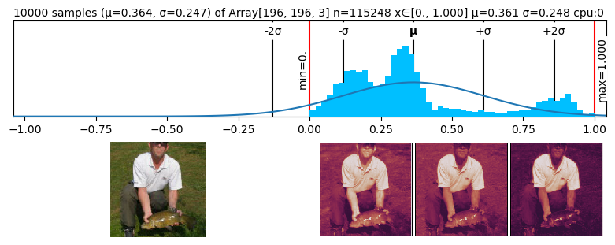

# 💘 Lovely JAX


<!-- WARNING: THIS FILE WAS AUTOGENERATED! DO NOT EDIT! -->

[](https://alexey.work/?ref=lj-md)

## [Read full docs](https://xl0.github.io/lovely-jax) \| ❤️ [Lovely Tensors](https://github.com/xl0/lovely-tensors) \| 💟 [Lovely `NumPy`](https://github.com/xl0/lovely-numpy) \| [Discord](https://discord.gg/4NxRV7NH)

## Note: I’m pretty new to JAX

If something does not make sense, shoot me an
[Issue](https://github.com/xl0/lovely-jax/issues) or ping me on Discord
and let me know how it’s supposed to work!

Better support for sharded arrays and solid jit/pmap/vmap support coming
soon!

## Install

``` sh
pip install lovely-jax
```

## How to use

How often do you find yourself debugging JAX code? You dump an array to
the cell output, and see this:

``` python
numbers
```

    Array([[[-0.35405433, -0.33692956, -0.4054286 , ..., -0.55955136,
             -0.4739276 ,  2.2489083 ],
            [-0.4054286 , -0.42255333, -0.49105233, ..., -0.91917115,
             -0.8506721 ,  2.1632845 ],
            [-0.4739276 , -0.4739276 , -0.5424266 , ..., -1.0390445 ,
             -1.0390445 ,  2.1975338 ],
            ...,
            [-0.9020464 , -0.8335474 , -0.9362959 , ..., -1.4671633 ,
             -1.2959158 ,  2.2317834 ],
            [-0.8506721 , -0.78217316, -0.9362959 , ..., -1.6041614 ,
             -1.5014129 ,  2.1804092 ],
            [-0.8335474 , -0.81642264, -0.9705454 , ..., -1.6555357 ,
             -1.5527872 ,  2.11191   ]],

           [[-0.19747896, -0.19747896, -0.30252096, ..., -0.47759098,
             -0.37254897,  2.4110641 ],
            [-0.24999997, -0.23249297, -0.33753496, ..., -0.705182  ,
             -0.670168  ,  2.3585434 ],
            [-0.30252096, -0.28501397, -0.39005598, ..., -0.740196  ,
             -0.810224  ,  2.3760502 ],
            ...,
            [-0.42507   , -0.23249297, -0.37254897, ..., -1.0903361 ,
             -1.0203081 ,  2.4285715 ],
            [-0.39005598, -0.23249297, -0.42507   , ..., -1.230392  ,
             -1.230392  ,  2.4110641 ],
            [-0.40756297, -0.28501397, -0.47759098, ..., -1.2829131 ,
             -1.2829131 ,  2.3410363 ]],

           [[-0.67154676, -0.9852723 , -0.88069713, ..., -0.9678431 ,
             -0.68897593,  2.3959913 ],
            [-0.7238344 , -1.0724182 , -0.9678431 , ..., -1.2467101 ,
             -1.0201306 ,  2.3262744 ],
            [-0.82840955, -1.1247058 , -1.0201306 , ..., -1.2641394 ,
             -1.1595641 ,  2.3785625 ],
            ...,
            [-1.229281  , -1.4732897 , -1.3861438 , ..., -1.5081482 ,
             -1.2641394 ,  2.5179958 ],
            [-1.1944225 , -1.4558606 , -1.4210021 , ..., -1.6475817 ,
             -1.4732897 ,  2.4308496 ],
            [-1.229281  , -1.5255773 , -1.5081482 , ..., -1.68244   ,
             -1.5255773 ,  2.3611329 ]]], dtype=float32)

Was it really useful for you, as a human, to see all these numbers?

What is the shape? The size?  
What are the statistics?  
Are any of the values `nan` or `inf`?  
Is it an image of a man holding a tench?

``` python
import lovely_jax as lj
```

``` python
lj.monkey_patch()
```

## Summary

``` python
numbers
```

    Array[196, 196, 3] n=115248 (0.4Mb) x∈[-2.118, 2.640] μ=-0.388 σ=1.073 cpu:0

Better, huh?

``` python
numbers[1,:6,1] # Still shows values if there are not too many.
```

    Array[6] x∈[-0.408, -0.232] μ=-0.340 σ=0.075 cpu:0 [-0.250, -0.232, -0.338, -0.408, -0.408, -0.408]

``` python
spicy = numbers.flatten()[:12].copy()

spicy = (spicy  .at[0].mul(10000)
                .at[1].divide(10000)
                .at[2].set(float('inf'))
                .at[3].set(float('-inf'))
                .at[4].set(float('nan'))
                .reshape((2,6)))
spicy # Spicy stuff
```

    Array[2, 6] n=12 x∈[-3.541e+03, -1.975e-05] μ=-393.848 σ=1.113e+03 +Inf! -Inf! NaN! cpu:0

``` python
jnp.zeros((10, 10)) # A zero array - make it obvious
```

    Array[10, 10] n=100 all_zeros cpu:0

``` python
spicy.v # Verbose
```

    Array[2, 6] n=12 x∈[-3.541e+03, -1.975e-05] μ=-393.848 σ=1.113e+03 +Inf! -Inf! NaN! cpu:0
    Array([[-3.5405432e+03, -1.9747897e-05,            inf,           -inf,
                       nan, -9.8527229e-01],
           [-4.0542859e-01, -3.0252096e-01, -8.8069713e-01, -4.3967807e-01,
            -3.0252096e-01, -7.7612197e-01]], dtype=float32)

``` python
spicy.p # The plain old way
```

    Array([[-3.5405432e+03, -1.9747897e-05,            inf,           -inf,
                       nan, -9.8527229e-01],
           [-4.0542859e-01, -3.0252096e-01, -8.8069713e-01, -4.3967807e-01,
            -3.0252096e-01, -7.7612197e-01]], dtype=float32)

## Going `.deeper`

``` python
numbers.deeper
```

    Array[196, 196, 3] n=115248 (0.4Mb) x∈[-2.118, 2.640] μ=-0.388 σ=1.073 cpu:0
      Array[196, 3] n=588 x∈[-1.912, 2.411] μ=-0.728 σ=0.519 cpu:0
      Array[196, 3] n=588 x∈[-1.861, 2.359] μ=-0.778 σ=0.450 cpu:0
      Array[196, 3] n=588 x∈[-1.758, 2.379] μ=-0.838 σ=0.437 cpu:0
      Array[196, 3] n=588 x∈[-1.656, 2.466] μ=-0.878 σ=0.415 cpu:0
      Array[196, 3] n=588 x∈[-1.717, 2.448] μ=-0.882 σ=0.399 cpu:0
      Array[196, 3] n=588 x∈[-1.717, 2.431] μ=-0.905 σ=0.408 cpu:0
      Array[196, 3] n=588 x∈[-1.563, 2.448] μ=-0.859 σ=0.416 cpu:0
      Array[196, 3] n=588 x∈[-1.475, 2.431] μ=-0.791 σ=0.463 cpu:0
      Array[196, 3] n=588 x∈[-1.526, 2.429] μ=-0.759 σ=0.499 cpu:0
      ...

``` python
# You can go deeper if you need to
numbers[:3,:5,:3].deeper(2)
```

    Array[3, 5, 3] n=45 x∈[-1.316, -0.197] μ=-0.593 σ=0.302 cpu:0
      Array[5, 3] n=15 x∈[-0.985, -0.197] μ=-0.491 σ=0.267 cpu:0
        Array[3] x∈[-0.672, -0.197] μ=-0.408 σ=0.197 cpu:0 [-0.354, -0.197, -0.672]
        Array[3] x∈[-0.985, -0.197] μ=-0.507 σ=0.343 cpu:0 [-0.337, -0.197, -0.985]
        Array[3] x∈[-0.881, -0.303] μ=-0.530 σ=0.252 cpu:0 [-0.405, -0.303, -0.881]
        Array[3] x∈[-0.776, -0.303] μ=-0.506 σ=0.199 cpu:0 [-0.440, -0.303, -0.776]
        Array[3] x∈[-0.916, -0.215] μ=-0.506 σ=0.298 cpu:0 [-0.388, -0.215, -0.916]
      Array[5, 3] n=15 x∈[-1.212, -0.232] μ=-0.609 σ=0.302 cpu:0
        Array[3] x∈[-0.724, -0.250] μ=-0.460 σ=0.197 cpu:0 [-0.405, -0.250, -0.724]
        Array[3] x∈[-1.072, -0.232] μ=-0.576 σ=0.360 cpu:0 [-0.423, -0.232, -1.072]
        Array[3] x∈[-0.968, -0.338] μ=-0.599 σ=0.268 cpu:0 [-0.491, -0.338, -0.968]
        Array[3] x∈[-0.968, -0.408] μ=-0.651 σ=0.235 cpu:0 [-0.577, -0.408, -0.968]
        Array[3] x∈[-1.212, -0.408] μ=-0.761 σ=0.336 cpu:0 [-0.662, -0.408, -1.212]
      Array[5, 3] n=15 x∈[-1.316, -0.285] μ=-0.677 σ=0.306 cpu:0
        Array[3] x∈[-0.828, -0.303] μ=-0.535 σ=0.219 cpu:0 [-0.474, -0.303, -0.828]
        Array[3] x∈[-1.125, -0.285] μ=-0.628 σ=0.360 cpu:0 [-0.474, -0.285, -1.125]
        Array[3] x∈[-1.020, -0.390] μ=-0.651 σ=0.268 cpu:0 [-0.542, -0.390, -1.020]
        Array[3] x∈[-1.003, -0.478] μ=-0.708 σ=0.219 cpu:0 [-0.645, -0.478, -1.003]
        Array[3] x∈[-1.316, -0.513] μ=-0.865 σ=0.336 cpu:0 [-0.765, -0.513, -1.316]

## Now in `.rgb` color

The important queston - is it our man?

``` python
numbers.rgb
```


*Maaaaybe?* Looks like someone normalized him.

``` python
in_stats = ( (0.485, 0.456, 0.406),     # mean
             (0.229, 0.224, 0.225) )    # std

# numbers.rgb(in_stats, cl=True) # For channel-last input format
numbers.rgb(in_stats)
```


It’s indeed our hero, the Tenchman!

## `.plt` the statistics

``` python
(numbers+3).plt
```



``` python
(numbers+3).plt(center="mean", max_s=1000)
```



``` python
(numbers+3).plt(center="range")
```



## See the `.chans`

``` python
# .chans will map values betwen [-1,1] to colors.
# Make our values fit into that range to avoid clipping.
mean = jnp.array(in_stats[0])
std = jnp.array(in_stats[1])
numbers_01 = (numbers*std + mean)
numbers_01
```

    Array[196, 196, 3] n=115248 (0.4Mb) x∈[0., 1.000] μ=0.361 σ=0.248 cpu:0

``` python
numbers_01.chans
```


## Grouping

``` python
# Make 8 images with progressively higher brightness and stack them 2x2x2.
eight_images = (jnp.stack([numbers]*8) + jnp.linspace(-2, 2, 8)[:,None,None,None])
eight_images = (eight_images
                     *jnp.array(in_stats[1])
                     +jnp.array(in_stats[0])
                ).clip(0,1).reshape(2,2,2,196,196,3)

eight_images
```

    Array[2, 2, 2, 196, 196, 3] n=921984 (3.5Mb) x∈[0., 1.000] μ=0.382 σ=0.319 cpu:0

``` python
eight_images.rgb
```


## Sharding

``` python
assert jax.__version_info__[0] == 0
from jax.sharding import NamedSharding, Mesh, PartitionSpec as P
from jax.experimental import mesh_utils

# Create a mesh with named axes
devices = mesh_utils.create_device_mesh((4, 2))
mesh = Mesh(devices, axis_names=('y', 'x'))

# Create sharding with PartitionSpec
sharding = NamedSharding(mesh, P('y', 'x'))

x = jax.random.normal(jax.random.PRNGKey(0), (8192, 8192))
y = jax.device_put(x, sharding)

jax.debug.visualize_array_sharding(y)

print(y)
```

<pre style="white-space:pre;overflow-x:auto;line-height:normal;font-family:Menlo,'DejaVu Sans Mono',consolas,'Courier New',monospace"><span style="color: #ffffff; text-decoration-color: #ffffff; background-color: #393b79">            </span><span style="color: #ffffff; text-decoration-color: #ffffff; background-color: #d6616b">            </span>
<span style="color: #ffffff; text-decoration-color: #ffffff; background-color: #393b79">   CPU 0    </span><span style="color: #ffffff; text-decoration-color: #ffffff; background-color: #d6616b">   CPU 1    </span>
<span style="color: #ffffff; text-decoration-color: #ffffff; background-color: #393b79">            </span><span style="color: #ffffff; text-decoration-color: #ffffff; background-color: #d6616b">            </span>
<span style="color: #ffffff; text-decoration-color: #ffffff; background-color: #8ca252">            </span><span style="color: #ffffff; text-decoration-color: #ffffff; background-color: #de9ed6">            </span>
<span style="color: #ffffff; text-decoration-color: #ffffff; background-color: #8ca252">   CPU 2    </span><span style="color: #ffffff; text-decoration-color: #ffffff; background-color: #de9ed6">   CPU 3    </span>
<span style="color: #ffffff; text-decoration-color: #ffffff; background-color: #8ca252">            </span><span style="color: #ffffff; text-decoration-color: #ffffff; background-color: #de9ed6">            </span>
<span style="color: #000000; text-decoration-color: #000000; background-color: #e7cb94">            </span><span style="color: #ffffff; text-decoration-color: #ffffff; background-color: #6b6ecf">            </span>
<span style="color: #000000; text-decoration-color: #000000; background-color: #e7cb94">   CPU 4    </span><span style="color: #ffffff; text-decoration-color: #ffffff; background-color: #6b6ecf">   CPU 5    </span>
<span style="color: #000000; text-decoration-color: #000000; background-color: #e7cb94">            </span><span style="color: #ffffff; text-decoration-color: #ffffff; background-color: #6b6ecf">            </span>
<span style="color: #ffffff; text-decoration-color: #ffffff; background-color: #a55194">            </span><span style="color: #ffffff; text-decoration-color: #ffffff; background-color: #8c6d31">            </span>
<span style="color: #ffffff; text-decoration-color: #ffffff; background-color: #a55194">   CPU 6    </span><span style="color: #ffffff; text-decoration-color: #ffffff; background-color: #8c6d31">   CPU 7    </span>
<span style="color: #ffffff; text-decoration-color: #ffffff; background-color: #a55194">            </span><span style="color: #ffffff; text-decoration-color: #ffffff; background-color: #8c6d31">            </span>
</pre>

    Array[8192, 8192] n=67108864 (0.2Gb) x∈[-5.420, 5.220] μ=1.508e-05 σ=1.000 S[y,x] 4×2 cpu:0-7

## Options \| [Docs](utils.config.html)

``` python
from lovely_jax import set_config, config
```

``` python
set_config(precision=5, sci_mode=True, color=False)
jnp.array([1., 2, jnp.nan])
```

    Array[3] μ=1.50000e+00 σ=5.00000e-01 NaN! cpu:0 [1.00000e+00, 2.00000e+00, nan]

``` python
set_config(precision=None, sci_mode=None, color=None) # None -> Reset to defaults
```

``` python
print(jnp.array([1., 2]))
# Or with config context manager.
with config(sci_mode=True, precision=5):
    print(jnp.array([1., 2]))

print(jnp.array([1., 2]))
```

    Array[2] μ=1.500 σ=0.500 cpu:0 [1.000, 2.000]
    Array[2] μ=1.50000e+00 σ=5.00000e-01 cpu:0 [1.00000e+00, 2.00000e+00]
    Array[2] μ=1.500 σ=0.500 cpu:0 [1.000, 2.000]

## Without `.monkey_patch`

``` python
lj.lovely(spicy)
```

    Array[2, 6] n=12 x∈[-3.541e+03, -1.975e-05] μ=-393.848 σ=1.113e+03 +Inf! -Inf! NaN! cpu:0

``` python
lj.lovely(spicy, verbose=True)
```

    Array[2, 6] n=12 x∈[-3.541e+03, -1.975e-05] μ=-393.848 σ=1.113e+03 +Inf! -Inf! NaN! cpu:0
    Array([[-3.5405432e+03, -1.9747897e-05,            inf,           -inf,
                       nan, -9.8527229e-01],
           [-4.0542859e-01, -3.0252096e-01, -8.8069713e-01, -4.3967807e-01,
            -3.0252096e-01, -7.7612197e-01]], dtype=float32)

``` python
lj.lovely(numbers, depth=1)
```

    Array[196, 196, 3] n=115248 (0.4Mb) x∈[-2.118, 2.640] μ=-0.388 σ=1.073 cpu:0
      Array[196, 3] n=588 x∈[-1.912, 2.411] μ=-0.728 σ=0.519 cpu:0
      Array[196, 3] n=588 x∈[-1.861, 2.359] μ=-0.778 σ=0.450 cpu:0
      Array[196, 3] n=588 x∈[-1.758, 2.379] μ=-0.838 σ=0.437 cpu:0
      Array[196, 3] n=588 x∈[-1.656, 2.466] μ=-0.878 σ=0.415 cpu:0
      Array[196, 3] n=588 x∈[-1.717, 2.448] μ=-0.882 σ=0.399 cpu:0
      Array[196, 3] n=588 x∈[-1.717, 2.431] μ=-0.905 σ=0.408 cpu:0
      Array[196, 3] n=588 x∈[-1.563, 2.448] μ=-0.859 σ=0.416 cpu:0
      Array[196, 3] n=588 x∈[-1.475, 2.431] μ=-0.791 σ=0.463 cpu:0
      Array[196, 3] n=588 x∈[-1.526, 2.429] μ=-0.759 σ=0.499 cpu:0
      ...

``` python
lj.rgb(numbers, in_stats)
```


``` python
lj.plot(numbers, center="mean")
```



``` python
lj.chans(numbers_01)
```


## Matplotlib integration \| [Docs](matplotlib.html)

``` python
numbers.rgb(in_stats).fig # matplotlib figure
```


``` python
(numbers*0.3+0.5).chans.fig # matplotlib figure
```


``` python
numbers.plt.fig.savefig('pretty.svg') # Save it
```

``` python
!file pretty.svg; rm pretty.svg
```

    pretty.svg: SVG Scalable Vector Graphics image

### Add content to existing Axes

``` python
fig = plt.figure(figsize=(8,3))
fig.set_constrained_layout(True)
gs = fig.add_gridspec(2,2)
ax1 = fig.add_subplot(gs[0, :])
ax2 = fig.add_subplot(gs[1, 0])
ax3 = fig.add_subplot(gs[1,1:])

ax2.set_axis_off()
ax3.set_axis_off()

numbers_01.plt(ax=ax1)
numbers_01.rgb(ax=ax2)
numbers_01.chans(ax=ax3);
```



## Import hook

Lovely JAX installs an import hook. Set `LOVELY_JAX=1`, and it will load
automatically, no need to modify the code:

> Note: You can now set it globally. The installed import hook will
> trigger only when JAX is imported.

``` python
import jax

x = jax.random.normal(jax.random.PRNGKey(0), (4, 16))
print(x)
```

``` bash
LOVELY_JAX=1 python test.py
```

    x: Array[4, 16] n=64 x∈[-1.955, 2.180] μ=0.031 σ=0.960 cpu:0

This is especially useful in combination with [Better
Exceptions](https://github.com/Qix-/better-exceptions):

> Note: Better exceptions seems to be not working with Python 3.13:
> https://github.com/Qix-/better-exceptions/issues/134

``` python
import jax
import jax.numpy as jnp

x = jax.random.normal(jax.random.PRNGKey(0), (4, 16))
print(f"x: {x}")

w = jax.random.normal(jax.random.PRNGKey(1), (15, 8))
y = jnp.matmul(x, w)  # Dimension mismatch
```

``` bash
BETTER_EXCEPTIONS=1 LOVELY_JAX=1 python test.py
```

    x: Array[4, 16] n=64 x∈[-1.955, 2.180] μ=0.031 σ=0.960 cpu:0
    Traceback (most recent call last):
      File "/home/xl0/work/projects/lovely-jax/test.py", line 9, in <module>
        y = jnp.matmul(x, w)  # Dimension mismatch
            │          │  └ Array[15, 8] n=120 x∈[-2.746, 2.608] μ=-0.003 σ=1.072 cpu:0
            │          └ Array[4, 16] n=64 x∈[-1.955, 2.180] μ=0.031 σ=0.960 cpu:0
            └ <module 'jax.numpy' from '...'>
      File "...jax/_src/numpy/tensor_contractions.py", line 254, in matmul
        out = lax.dot_general(
    TypeError: dot_general requires contracting dimensions to have the same shape, got (16,) and (15,).
